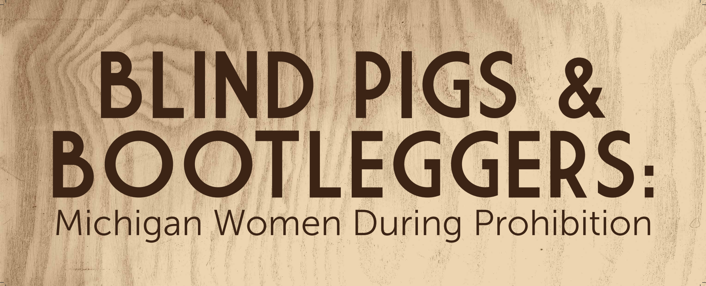

In fulfillment of the requirements for my Master of Arts in Public History degree, I created an exhibit titled "Blind Pigs and Bootleggers: Michigan Women During Prohibition" to be displayed at the Dossin Great Lakes Museum on Belle Isle through Summer 2026. In order to tell the stories of women involved in the illicit alcohol trade in Southeast Michigan, I conducted original research at the National Archives in Chicago and collected family histories from community members in Metro Detroit to highlight in the exhibition.

[Exhibit Image Link](blindpigpanels.pdf)