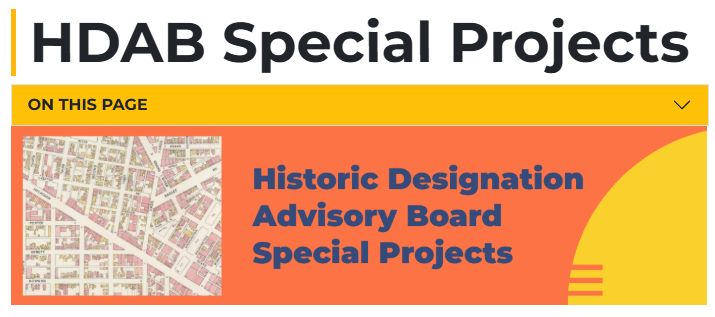

For my Winter 2024 internship with the City of Detroit's Historic Designation Advisory Board, I used the ArcGIS StoryMap program to create three digital exhibits on the history of Detroit's Cass Corridor:

[Cass Corridor's Chinatown](https://storymaps.arcgis.com/stories/66fbeec68dba4b5f98f0ff2560586a4d)

[Cass Corridor's Native Communities](https://storymaps.arcgis.com/stories/f9ca681b21234869bd95c0597351440a)

[Wayne State University in the Cass Corridor](https://storymaps.arcgis.com/stories/4c40756d1c7b46899c24e0a45bad42dfS)