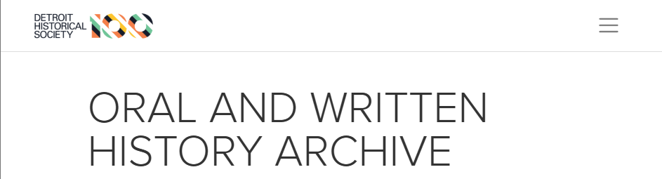

Working as an Oral History Coordinator for the Detroit Historical Society, I've assisted with several oral history projects, and with the digital archive's ongoing management. This work includes conducting interviews, editing transcripts, and managing metadata. 

[Oral Histories About Covid-19](https://www.detroithistorical.org/learn/online-research/collection/by-collection/oral-histories-about-covid-19)

[Climate Change Oral Histories](https://www.detroithistorical.org/learn/online-research/collection/by-collection/climate-change-oral-history)

[The Hustle: Black Entrepreneurship in Detroit](https://www.detroithistorical.org/learn/online-research/collection/by-collection/hustle-black-entrepreneurship-detroit?page=1)